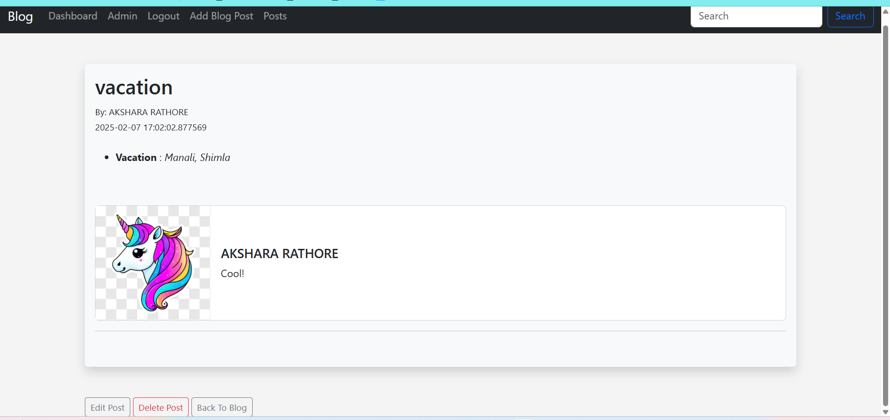

# 📝 Blog Post Application


A web application that allows users to register, log in, create, edit, and delete blog posts. Built with Flask, Jinja2 templates, SQLite database, and styled with HTML/CSS.

## ✨ Features

- **🔐 User Authentication**: Secure registration and login system
- **📋 Blog Management**: Create, read, update, and delete blog posts
- **🛡️ User Access Control**: Only authenticated users can perform CRUD operations
- **📱 Responsive Design**: Mobile-friendly interface

## 🛠️ Technologies Used

- **🐍 Flask (40%)**: Python web framework for backend development
- **🧩 Jinja2 (10%)**: Template engine for rendering dynamic HTML
- **💾 SQLite (20%)**: Lightweight database for storing user and post data
- **🎨 HTML & CSS (30%)**: Frontend structure and styling

## 📋 Prerequisites

- Python 3.9 or higher
- pip package manager
- Git

## 🚀 Installation

1. Clone the repository:
   ```bash
   git clone https://github.com/ItsAksharaRathore/blog-post.git
   cd blog-post
   ```

2. Create and activate a virtual environment:
   ```bash
   python -m venv venv
   source venv/bin/activate  # On Windows: venv\Scripts\activate
   ```

3. Install dependencies:
   ```bash
   pip install -r requirements.txt
   ```

4. Initialize the database:
   ```bash
   flask init-db
   ```

5. Run the application:
   ```bash
   flask run
   ```

6. Access the application at `http://127.0.0.1:5000`

## 🖥️ Usage

1. Register a new account
2. Log in with your credentials
3. Create new blog posts from your dashboard
4. View all posts from the home page
5. Edit or delete your own posts

## 📷 Screenshots

<div align="center">
  
  
</div>

## 🔄 API Endpoints

| Method | Endpoint | Description | Auth Required |
|--------|----------|-------------|--------------|
| GET    | /        | Home page   | No           |
| GET    | /login   | Login page  | No           |
| POST   | /login   | Login user  | No           |
| GET    | /register| Register page | No         |
| POST   | /register| Register user | No         |
| GET    | /dashboard | User dashboard | Yes     |
| GET    | /post/new | New post form | Yes       |
| POST   | /post/new | Create post | Yes         |
| GET    | /post/<id> | View post | No           |
| GET    | /post/<id>/edit | Edit post form | Yes |
| POST   | /post/<id>/edit | Update post | Yes   |
| POST   | /post/<id>/delete | Delete post | Yes |

## 🤝 Contributing

Contributions are what make the open-source community such an amazing place to learn, inspire, and create. Any contributions you make are **greatly appreciated**.

1. Fork the repository
2. Create a new branch (`git checkout -b feature/amazing-feature`)
3. Commit your changes (`git commit -m 'Add some amazing feature'`)
4. Push to the branch (`git push origin feature/amazing-feature`)
5. Open a Pull Request

## 📜 License

This project is licensed under the MIT License - see the [LICENSE](LICENSE) file for details.

## 📬 Contact

Feel free to reach out if you have any questions or feedback:

- **Email**: itsAksharaRathore@gmail.com
- **GitHub**: [ItsAksharaRathore](https://github.com/ItsAksharaRathore)
- **LinkedIn**: [Akshara Rathore](https://www.linkedin.com/in/itsAksharaRathore)

---

<div align="center">
  <sub>Built with ❤️ by Akshara Rathore</sub>
</div>